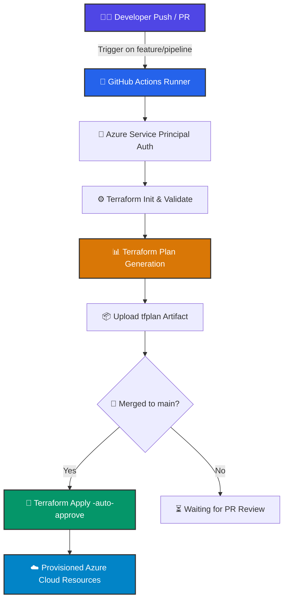

<div align="center">

# ⚡ Azure Infrastructure Automation Pipeline 🌩️

### *Automated Infrastructure as Code (IaC) with Terraform & GitHub Actions*

[](https://www.terraform.io/)
[](https://azure.microsoft.com/)
[](https://github.com/features/actions)
[](#-security--compliance)
[](https://github.com/InquistiveSantu/GitHub-Action-pipeline/actions)

---

<p align="center">
  <a href="#-key-features">Key Features</a> •
  <a href="#-architecture--workflow">Architecture</a> •
  <a href="#-directory-structure">Directory Structure</a> •
  <a href="#-getting-started">Getting Started</a> •
  <a href="#-cicd-pipeline">CI/CD Pipeline</a> •
  <a href="#-security--compliance">Security</a>
</p>

</div>

---

## 🌟 Key Features

- 🏗️ **Modular IaC Architecture**: Clean separation between reusable `child_modules` and `Env_prod` deployment logic.
- ⚡ **Automated CI/CD Workflows**: Instant Terraform validation, formatting checks, and plan generation on Pull Requests.
- 🚀 **Zero-Downtime Auto-Apply**: Production deployments trigger automatically upon merging into the `main` branch.
- 🔒 **Enterprise-Grade Security**: Integrated `Gitleaks` credential detection and `tfsec` static code security analysis.
- 📦 **Artifact Management**: Automatic upload and retention of `tfplan` binary execution plans for transparent change tracking.
- 🌍 **Scalable Azure Infrastructure**: Built to provision VNet, Subnets, Public IPs, NSGs, NICs, and Virtual Machines dynamically.

---

## 🎯 Architecture & Workflow

### 🔄 End-to-End Pipeline Workflow



---

## 📂 Directory Structure

```text
📦 GitHub-Action-pipeline
 ┣ 📁 .github
 ┃ ┗ 📁 workflows
 ┃   ┗ 📜 terraform.yml                  ⚡ GitHub Actions CI/CD Pipeline Definition
 ┣ 📁 child_modules                      🧩 Reusable Infrastructure Modules
 ┃ ┣ 📁 azurerm_NSG                      🛡️ Network Security Group Module
 ┃ ┣ 📁 azurerm_Subnet                   🌐 Subnet Management Module
 ┃ ┣ 📁 azurerm_nic_card_virtual_machine 💻 Virtual Machine & NIC Provisioning
 ┃ ┣ 📁 azurerm_public_ip                🔗 Public IP Allocation Module
 ┃ ┣ 📁 azurerm_resource_group           📁 Resource Group Module
 ┃ ┗ 📁 azurerm_virtual_network          🌐 Virtual Network (VNet) Module
 ┣ 📁 Env_prod                           🚀 Production Deployment Environment
 ┃ ┣ 📜 main.tf                          🏗️ Main Entrypoint calling Child Modules
 ┃ ┣ 📜 provider.tf                      🔌 AzureRM Provider Configuration
 ┃ ┣ 📜 variables.tf                     🏷️ Input Variable Declarations
 ┃ ┣ 📜 terraform.tfvars                 ⚙️ Production Variable Values
 ┃ ┣ 📜 .gitleaks.toml                   🔒 Secret Scanner Configuration
 ┃ ┗ 📜 tfsec-report                     🛡️ Security Scan Audit Logs
 ┗ 📜 README.md                          📝 Project Documentation
```

---

## 🛠️ Provisioned Azure Resources

<details open>
<summary><b>👉 Click to expand / collapse resource breakdown</b></summary>

<br/>

| Icon | Resource Component | Module Source | Description |
| :---: | :--- | :--- | :--- |
| 📁 | **Resource Group** | `azurerm_resource_group` | Logical container for Azure resource organization and lifecycle management. |
| 🌐 | **Virtual Network (VNet)** | `azurerm_virtual_network` | Isolated private network backbone (`10.0.0.0/16`). |
| 🔌 | **Subnets** | `azurerm_Subnet` | Network segmentation inside VNet (`10.0.1.0/24` frontend/backend tiers). |
| 🔗 | **Public IP** | `azurerm_public_ip` | Dynamic/Static public IPv4 address assignment. |
| 🛡️ | **Network Security Group** | `azurerm_NSG` | Statefull firewall filter rules restricting incoming/outgoing traffic. |
| 💻 | **Virtual Machines & NICs** | `azurerm_nic_card_virtual_machine` | Compute Virtual Machines attached to Network Interface Cards (NICs). |

</details>

---

## 🏁 Getting Started

### 📋 Prerequisites

Before deploying locally or running CI/CD, ensure you have installed:

- 🛠️ [Terraform CLI](https://developer.hashicorp.com/terraform/downloads) `>= v1.0.0`
- 💻 [Azure CLI (`az`)](https://learn.microsoft.com/en-us/cli/azure/install-azure-cli)
- ☁️ Active **Azure Subscription** with an authenticated **Service Principal**

---

### 💻 Local Execution Guide

```bash
# 1️⃣ Clone the repository
git clone https://github.com/InquistiveSantu/GitHub-Action-pipeline.git
cd GitHub-Action-pipeline/Env_prod

# 2️⃣ Log in to your Azure Account
az login

# 3️⃣ Export Azure Service Principal Credentials (Required for Terraform)
export ARM_CLIENT_ID="<YOUR_CLIENT_ID>"
export ARM_CLIENT_SECRET="<YOUR_CLIENT_SECRET>"
export ARM_SUBSCRIPTION_ID="<YOUR_SUBSCRIPTION_ID>"
export ARM_TENANT_ID="<YOUR_TENANT_ID>"

# 4️⃣ Initialize Terraform & Download Provider Plugins
terraform init

# 5️⃣ Validate Syntax and Configuration Integrity
terraform validate

# 6️⃣ Generate and Preview Execution Plan
terraform plan -out=tfplan

# 7️⃣ Apply Infrastructure Provisioning
terraform apply tfplan
```

---

## ⚙️ CI/CD Pipeline Architecture

The CI/CD workflow defined in [`.github/workflows/terraform.yml`](file:///.github/workflows/terraform.yml) runs automatically on GitHub Actions.

> [!IMPORTANT]
> **Pipeline Security Note**: Service Principal credentials must be configured in GitHub Secrets to grant automated deployment access to Azure.

### 🔑 Required GitHub Repository Secrets

| Secret Key Name | Category | Status | Description |
| :--- | :---: | :---: | :--- |
| `ARM_CLIENT_ID` | 🔒 Secret | 🟢 Active | Azure Service Principal Application ID |
| `ARM_CLIENT_SECRET` | 🔒 Secret | 🟢 Active | Azure Service Principal Password Secret |
| `ARM_SUBSCRIPTION_ID` | 🔒 Secret | 🟢 Active | Target Azure Subscription ID |
| `ARM_TENANT_ID` | 🔒 Secret | 🟢 Active | Azure Active Directory Tenant ID |

<details>
<summary><b>🔍 View Pipeline Stage Execution Steps</b></summary>

<br/>

1. **📥 Checkout Code**: Pulls down repository code onto `ubuntu-latest`.
2. **🛠️ Setup Terraform**: Initializes HashiCorp Terraform CLI `v3` action.
3. **💻 Azure CLI Setup & Login**: Authenticates non-interactively via `az login --service-principal`.
4. **🔍 Terraform Init & Validate**: Downloads `azurerm` provider version `=4.0.0` and runs code linting.
5. **📦 Artifact Upload**: Stores the generated `tfplan` as a downloadable artifact.
6. **🚀 Automated Apply**: Triggers `terraform apply -auto-approve` upon push to `main`.

</details>

---

## 🛡️ Security & Compliance

> [!TIP]
> **DevSecOps First**: Security checks are integrated directly into our infrastructure development workflow.

- 🔒 **Gitleaks Integration**: Pre-configured with `.gitleaks.toml` to audit commits and block accidental secret leakage.
- 🛡️ **Static Code Analysis (`tfsec`)**: Automated security scanning for cloud compliance and misconfiguration prevention.
- 🔐 **Zero Hardcoded Secrets**: All sensitive variables are dynamically supplied via environment variables or secret vaults.

---

<div align="center">

### ✨ Maintained with ❤️ for Cloud & DevOps Automation ✨

[](https://github.com/InquistiveSantu/GitHub-Action-pipeline)

</div>
